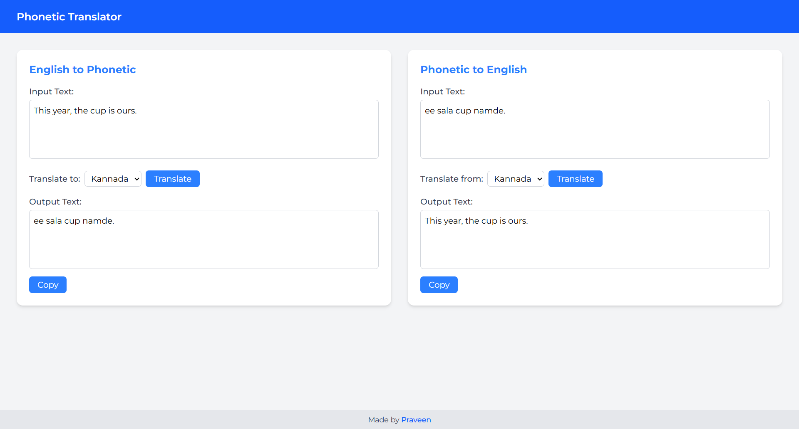

# Phonetic Translator App

A web application for two-way phonetic translation using the Gemini AI API. Translate English sentences into phonetic representations of Tamil, Telugu, Hindi, or Kannada (written in English letters), and translate phonetic text back into simple English.

## Features
- **English to Phonetic**: Translates English sentences into casual, phonetic sentences in the selected language (Tamil, Telugu, Hindi, or Kannada) using English letters.
- **Phonetic to English**: Translates phonetic text (written in English letters) from the selected language into simple English.
- **Copy to Clipboard**: Easily copy translated text with a single click.
- **Responsive Design**: User-friendly interface optimized for both desktop and mobile devices.
- **Language Selection**: Choose from Tamil, Telugu, Hindi, or Kannada for translations.

## Tech Stack
- **Frontend**: React, Tailwind CSS
- **API**: Gemini AI API (v1beta, model: gemini-2.0-flash)
- **HTTP Client**: Axios for API requests
- **Deployment**: Vite for fast builds and development

## Prerequisites
- Node.js (v16 or higher)
- A Gemini AI API key (set as `VITE_KEY` in your environment variables)
- Basic understanding of React and JavaScript

## Installation
1. Clone the repository:
   ```bash
   git clone https://github.com/praveen-4906/phonetic-translator.git
   cd phonetic-translator
   ```

2. Install dependencies:
   ```bash
   npm install
   ```

3. Create a `.env` file in the project root and add your Gemini AI API key:
   ```bash
   VITE_KEY=your_gemini_api_key_here
   ```

4. Start the development server:
   ```bash
   npm run dev
   ```

5. Open your browser and navigate to `http://localhost:5173` (or the port specified by Vite).

## Usage
1. **English to Phonetic**:
   - Enter an English sentence in the left textarea.
   - Select the target language (e.g., Tamil) from the dropdown.
   - Click "Translate" to generate a casual phonetic sentence.
   - Click "Copy" to copy the translated text.

2. **Phonetic to English**:
   - Enter a phonetic sentence (in English letters) in the right textarea.
   - Select the source language from the dropdown.
   - Click "Translate" to get the English translation.
   - Click "Copy" to copy the translated text.

## Example
- **English to Phonetic**:
  - Input: "How are you?"
  - Language: Tamil
  - Output: "Nee epdi irukke?"
- **Phonetic to English**:
  - Input: "Naa romba nalla irukken"
  - Language: Tamil
  - Output: "I am doing very well"

## Screenshot

